<div align="center">

# 🔑 SIMLIS — Sistem Monitoring Lisensi TI

**Pantau masa berlaku lisensi hardware & software di seluruh lokasi — dari Kantor Pusat sampai branch — dalam satu dashboard.**


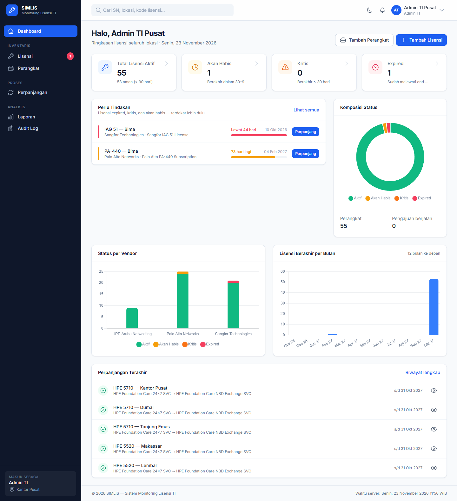

</div>

---

## 📑 Daftar Isi

- [Latar Belakang](#-latar-belakang)
- [Fitur Utama](#-fitur-utama)
- [Tampilan](#-tampilan)
- [Role & Hak Akses](#-role--hak-akses)
- [Alur Kerja](#-alur-kerja)
- [Arsitektur](#-arsitektur)
- [Struktur Database](#-struktur-database)
- [Struktur Folder](#-struktur-folder)
- [Instalasi & Menjalankan](#-instalasi--menjalankan)
- [Akun Demo](#-akun-demo)
- [Testing](#-testing)
- [Status Pengembangan](#-status-pengembangan)

---

## 💡 Latar Belakang

Perangkat jaringan seperti **Palo Alto** (firewall), **Sangfor** (internet access gateway), dan **HPE Aruba** (switch) — serta software seperti **Microsoft Office** — memiliki lisensi/subscription/warranty dengan masa berlaku. Jika terlambat diperpanjang, fitur keamanan bisa mati atau dukungan vendor hilang.

SIMLIS dibangun ulang dari prototipe HTML satu-file yang masih memiliki banyak kekurangan:

| Prototipe lama | SIMLIS |
|---|---|
| Toggle `ADMIN`/`VIEWER` tanpa login — siapa pun bisa jadi admin | Login + **4 role** + pembatasan data per branch |
| Data hardcode di JavaScript, hilang saat refresh | Tersimpan di **MySQL** |
| Perangkat & lisensi digabung satu baris | Tabel terpisah — 1 perangkat bisa punya banyak lisensi (subscription + warranty) |
| Vendor & tipe hardcode | Master data vendor, model, lokasi bisa dikelola |
| Hanya hardware | **Hardware & software** |
| Peringatan hanya H-4 | Status **Aktif / Akan Habis (≤90 hari) / Kritis (≤30 hari) / Expired**, ambang bisa diatur |
| Perpanjangan langsung menimpa data | Alur **pengajuan → persetujuan Manajemen → eksekusi Admin TI**, riwayat tersimpan |
| License key dikarang & tampil terbuka | Key **terenkripsi**, mendukung format teks / foto / tanpa key, hanya role tertentu yang bisa melihat |
| Tidak ada jejak audit | **Audit log** untuk setiap aksi |

---

## ✨ Fitur Utama

### 📊 Dashboard per role
- Kartu ringkasan: total lisensi aktif, akan habis, kritis, expired.
- Daftar **"Perlu Tindakan"** — lisensi terdekat habis, lengkap dengan progress masa berlaku dan tombol perpanjang.
- Grafik komposisi status, status per vendor, dan jumlah lisensi yang berakhir per bulan (12 bulan ke depan).
- PIC Branch mendapat banner peringatan khusus untuk branch-nya.

### 🗂️ Inventaris perangkat & lisensi
- Perangkat (unit fisik: serial number, model, hostname, IP, status) **terpisah** dari lisensi.
- Satu perangkat bisa memiliki beberapa lisensi (mis. subscription + warranty).
- Lisensi **hardware** (terikat perangkat) dan **software** (terikat produk, dengan jumlah seat).
- Tipe lisensi: Subscription, Support/Maintenance, Warranty, Perpetual, SaaS.
- Filter per status, vendor, lokasi, jenis aset, tipe lisensi + pencarian (kode, SN, lokasi, PO) + pilihan jumlah baris per halaman.

### 🔐 License key yang fleksibel & aman
Tidak semua lisensi memiliki key, sehingga setiap lisensi punya **format key**:

| Format | Contoh | Penyimpanan |
|---|---|---|
| **Tanpa license key** | Palo Alto, Sangfor, Aruba (terikat serial number) | — |
| **Kode teks** | Key yang bisa diketik | Kolom terenkripsi (`encrypted` cast) |
| **Foto / gambar** | Microsoft Office (stiker/kartu/screenshot) | File lampiran kategori khusus |

Key teks maupun foto key **hanya bisa dilihat Admin TI & Super Admin**.

### 🔄 Alur perpanjangan dengan persetujuan
Pengajuan → persetujuan/penolakan Manajemen → penyelesaian oleh Admin TI. Periode lama otomatis tersimpan sebagai **riwayat** pada setiap lisensi. Satu lisensi hanya boleh memiliki satu pengajuan berjalan.

### 📎 Dokumen & bukti
Lampiran per lisensi/perangkat/pengajuan: sertifikat lisensi, foto stiker SN, foto license key, PO, invoice, kontrak, BAST.

### 🔔 Notifikasi & reminder
Notifikasi in-app di header, dan reminder otomatis **H-90 / 60 / 30 / 14 / 7 / 1** sebelum lisensi habis (hari bisa diatur Super Admin), dengan pencatatan anti-dobel.

### 📈 Laporan & audit
Laporan per periode, per vendor, dan per lokasi + estimasi biaya perpanjangan; audit log mencatat siapa melakukan apa dan kapan.

### 🎨 UI modern
Responsif, **dark mode**, font Inter (dibundel — tetap jalan offline/intranet), ikon Heroicons, tanpa ketergantungan CDN.

---

## 📸 Tampilan

<table>
<tr>
<td width="50%">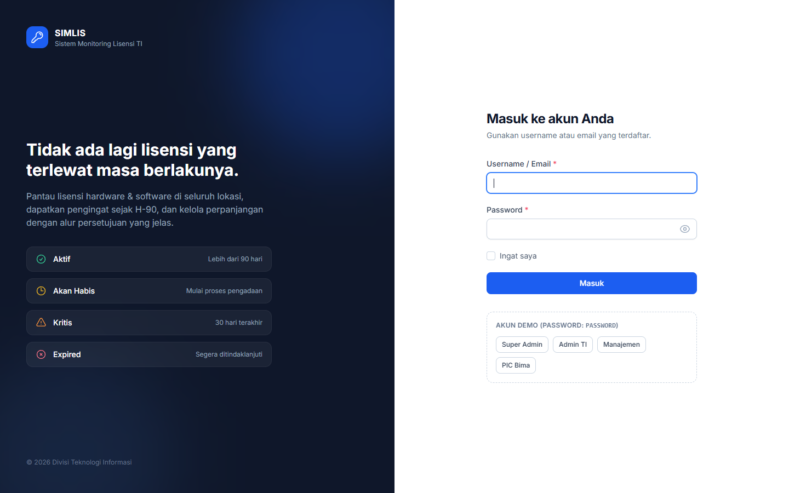<p align="center"><b>Login</b> — username/email, tombol akun demo di mode local</p></td>
<td width="50%">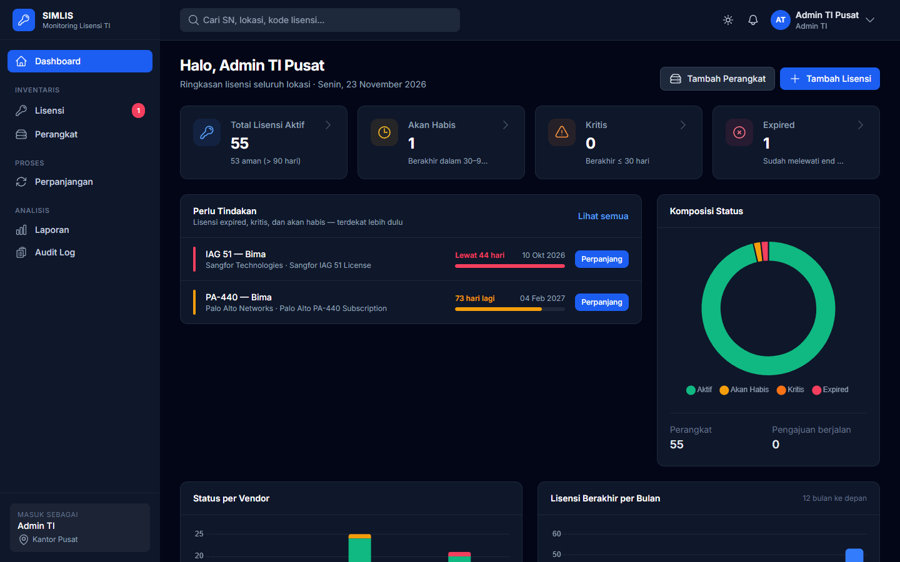<p align="center"><b>Dark mode</b></p></td>
</tr>
<tr>
<td>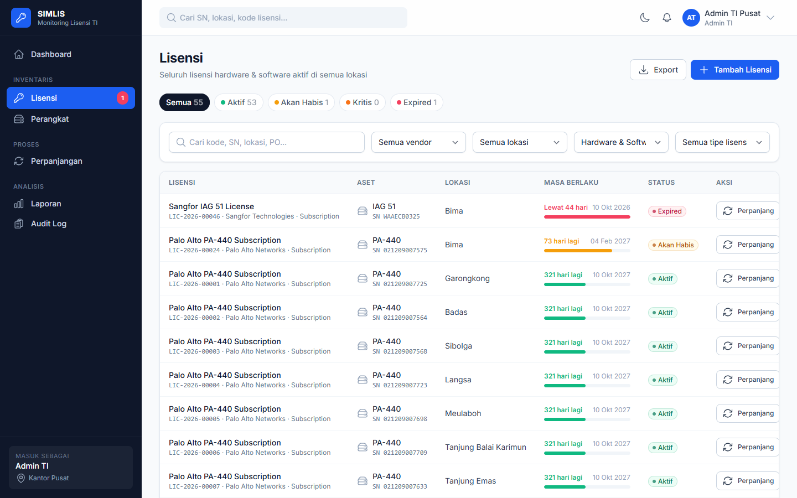<p align="center"><b>Daftar lisensi</b> — tab status, filter & progress masa berlaku</p></td>
<td>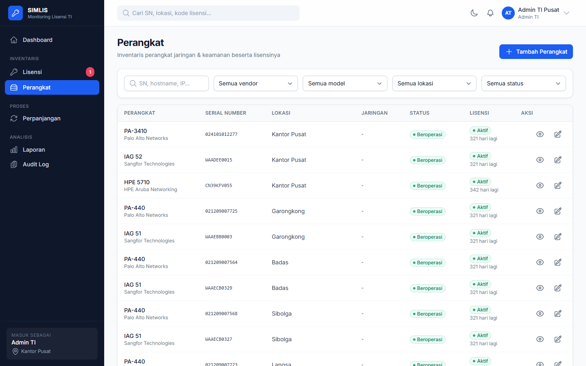<p align="center"><b>Daftar perangkat</b></p></td>
</tr>
<tr>
<td>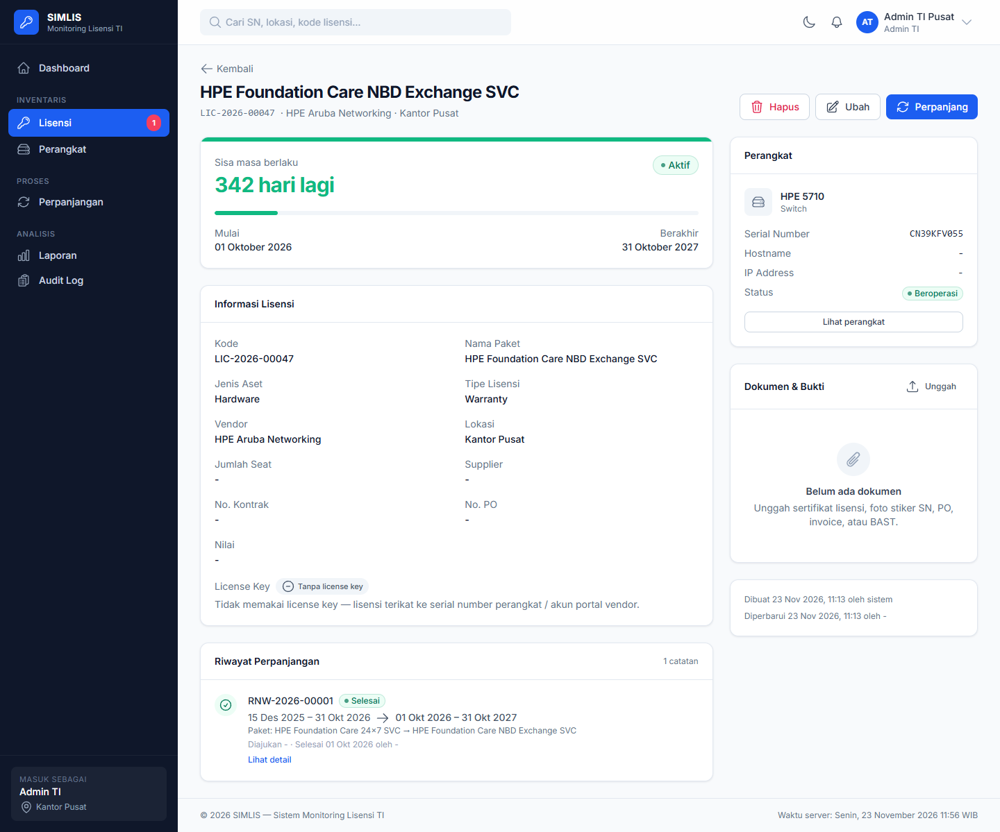<p align="center"><b>Detail lisensi</b> — masa berlaku, license key, riwayat perpanjangan</p></td>
<td>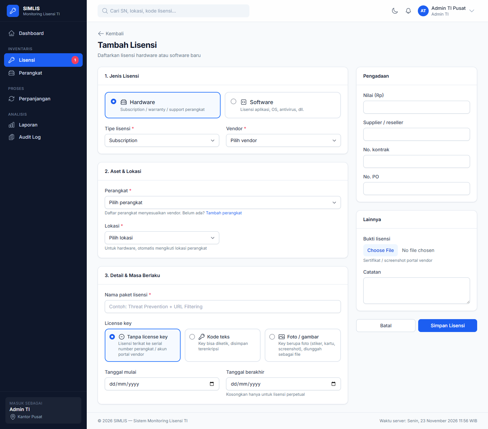<p align="center"><b>Form lisensi</b> — hardware/software & format license key</p></td>
</tr>
<tr>
<td>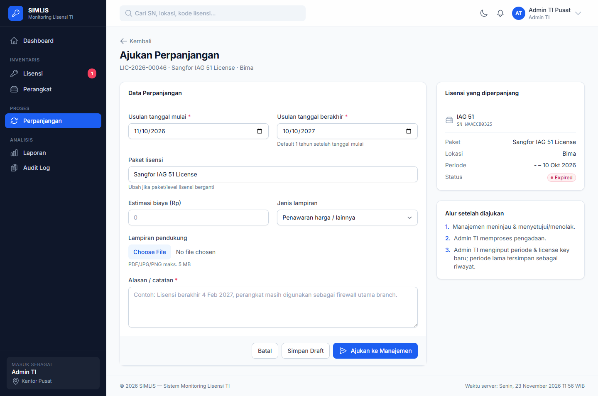<p align="center"><b>Pengajuan perpanjangan</b></p></td>
<td>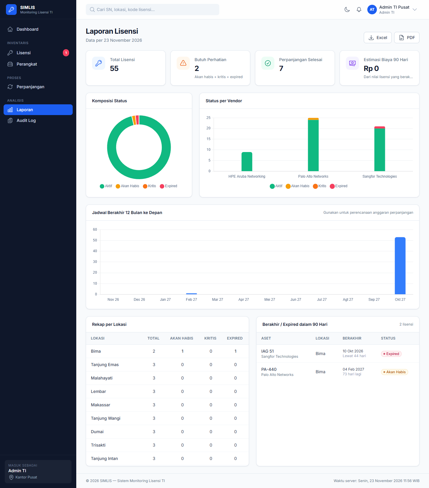<p align="center"><b>Laporan</b></p></td>
</tr>
<tr>
<td>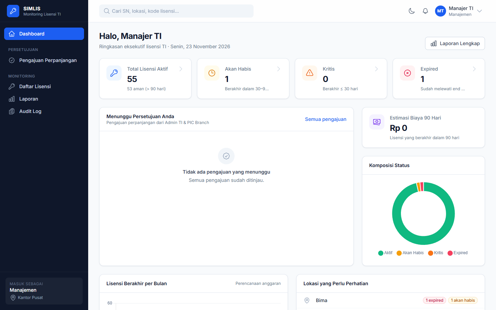<p align="center"><b>Dashboard Manajemen</b></p></td>
<td>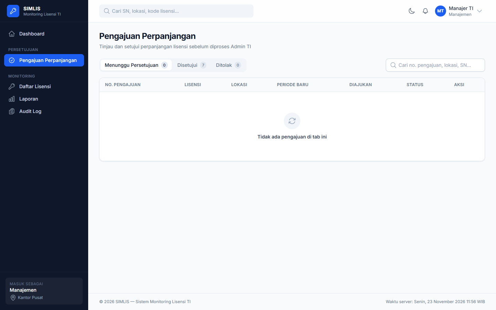<p align="center"><b>Persetujuan perpanjangan</b> (Manajemen)</p></td>
</tr>
<tr>
<td>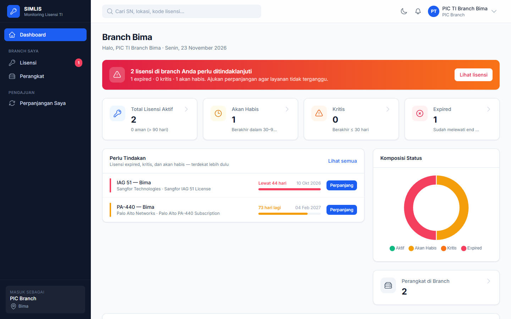<p align="center"><b>Dashboard PIC Branch</b> — hanya data branch sendiri</p></td>
<td>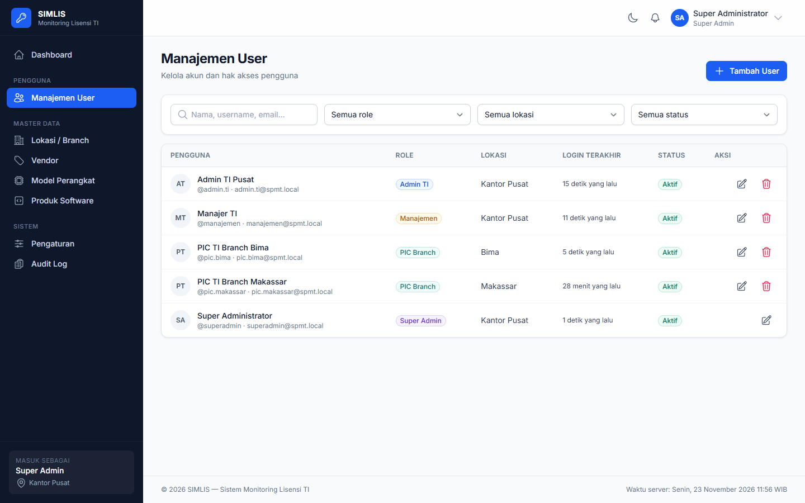<p align="center"><b>Kelola user</b> (Super Admin)</p></td>
</tr>
<tr>
<td>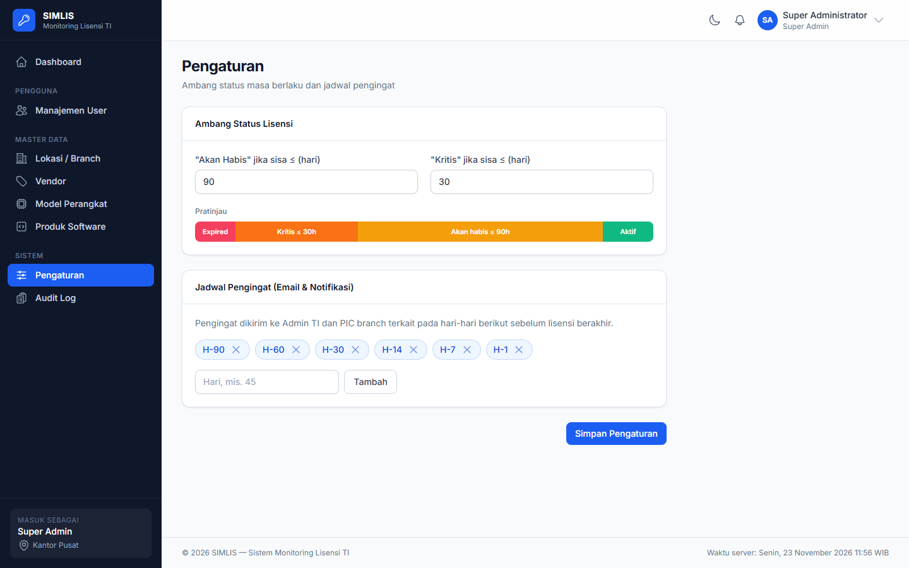<p align="center"><b>Pengaturan ambang status & reminder</b></p></td>
<td></td>
</tr>
</table>

---

## 👥 Role & Hak Akses

| Role | Untuk siapa | Cakupan data |
|---|---|---|
| **Super Admin** | Pengelola sistem: user, master data, pengaturan | Semua |
| **Admin TI** | Operator utama: kelola perangkat & lisensi, selesaikan perpanjangan | Semua |
| **Manajemen** | Pengambil keputusan: pantau & setujui/tolak perpanjangan | Semua (lihat saja) |
| **PIC Branch** | Penanggung jawab TI di tiap branch | **Branch sendiri** |

| Hak akses | Super Admin | Admin TI | Manajemen | PIC Branch |
|---|:-:|:-:|:-:|:-:|
| Dashboard | ✔ | ✔ | ✔ | ✔ |
| Lihat perangkat & lisensi | ✔ | ✔ | ✔ | ✔ (branch sendiri) |
| Tambah / ubah / hapus perangkat & lisensi | ✔ | ✔ | – | – |
| Lihat license key (teks & foto) | ✔ | ✔ | – | – |
| Ajukan perpanjangan | ✔ | ✔ | – | ✔ |
| Setujui / tolak perpanjangan | ✔ | – | ✔ | – |
| Selesaikan perpanjangan | ✔ | ✔ | – | – |
| Upload lampiran | ✔ | ✔ | – | ✔ |
| Laporan & export | ✔ | ✔ | ✔ | – |
| Audit log | ✔ | ✔ | ✔ | – |
| Kelola user, master data, pengaturan | ✔ | – | – | – |

> Sumber kebenaran hak akses: [`app/Enums/UserRole.php`](app/Enums/UserRole.php) → `permissions()`.
> Satu akun PIC Branch terikat ke satu branch; satu branch boleh memiliki lebih dari satu PIC.

---

## 🔄 Alur Kerja

### Status masa berlaku

Status **tidak disimpan** di database — selalu dihitung dari `end_date`, sehingga tidak pernah basi.

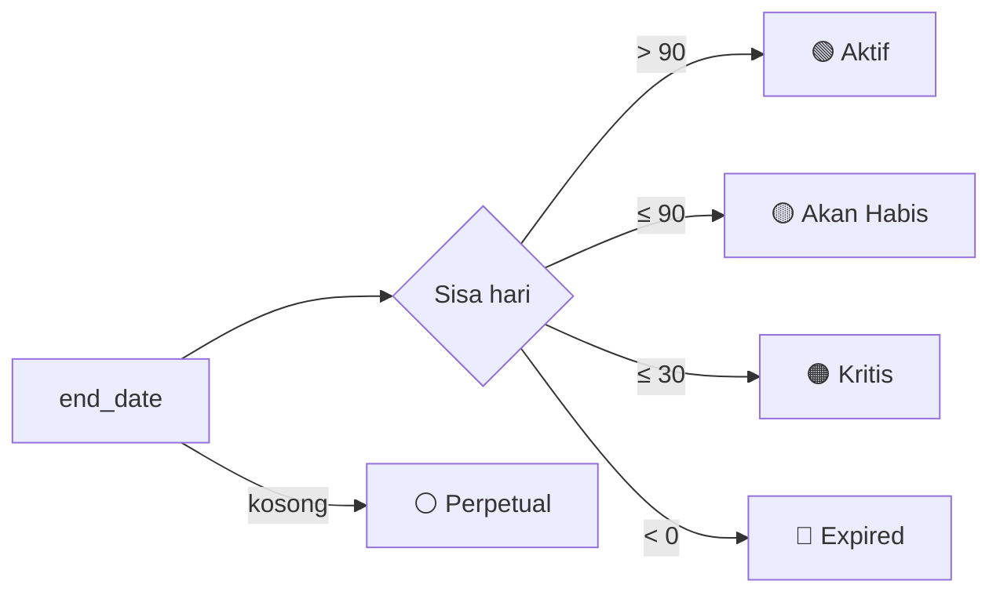
```mermaid
flowchart LR
    A[end_date] --> B{Sisa hari}
    B -->|"> 90"| C[🟢 Aktif]
    B -->|"≤ 90"| D[🟡 Akan Habis]
    B -->|"≤ 30"| E[🟠 Kritis]
    B -->|"< 0"| F[🔴 Expired]
    A -->|kosong| G[⚪ Perpetual]
```

Ambang 90/30 hari dapat diubah Super Admin di menu **Pengaturan**.

### Perpanjangan lisensi

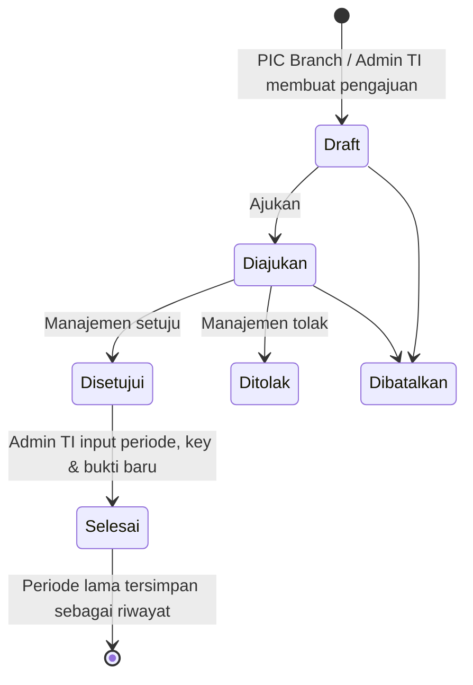
```mermaid
stateDiagram-v2
    [*] --> Draft: PIC Branch / Admin TI membuat pengajuan
    Draft --> Diajukan: Ajukan
    Diajukan --> Disetujui: Manajemen setuju
    Diajukan --> Ditolak: Manajemen tolak
    Disetujui --> Selesai: Admin TI input periode, key & bukti baru
    Draft --> Dibatalkan
    Diajukan --> Dibatalkan
    Selesai --> [*]: Periode lama tersimpan sebagai riwayat
```

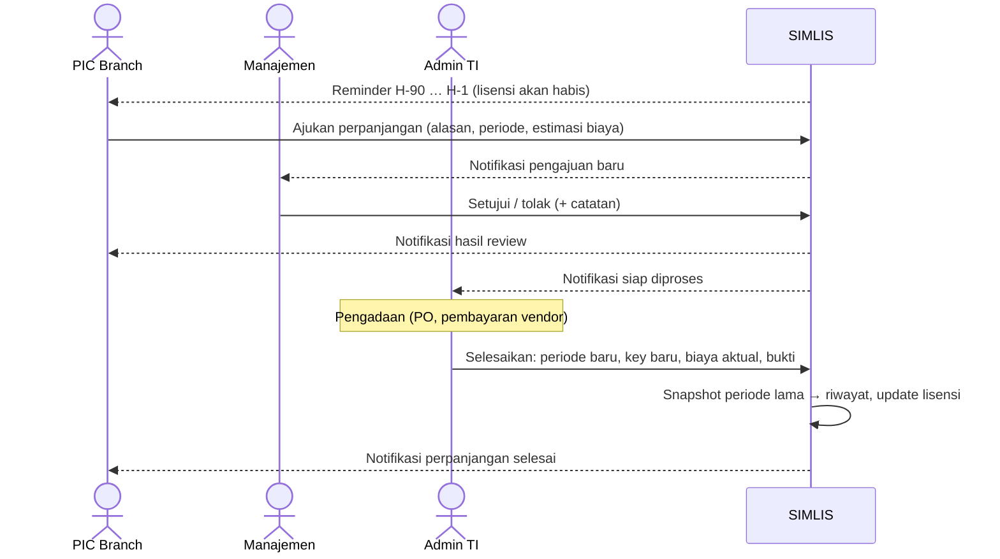
```mermaid
sequenceDiagram
    actor PIC as PIC Branch
    actor MGR as Manajemen
    actor ADM as Admin TI
    participant S as SIMLIS

    S-->>PIC: Reminder H-90 … H-1 (lisensi akan habis)
    PIC->>S: Ajukan perpanjangan (alasan, periode, estimasi biaya)
    S-->>MGR: Notifikasi pengajuan baru
    MGR->>S: Setujui / tolak (+ catatan)
    S-->>PIC: Notifikasi hasil review
    S-->>ADM: Notifikasi siap diproses
    Note over ADM: Pengadaan (PO, pembayaran vendor)
    ADM->>S: Selesaikan: periode baru, key baru, biaya aktual, bukti
    S->>S: Snapshot periode lama → riwayat, update lisensi
    S-->>PIC: Notifikasi perpanjangan selesai
```

---

## 🏗️ Arsitektur

Aplikasi monolit **Laravel MVC** dengan server-side rendering (Blade). Interaktivitas ringan di sisi klien memakai Alpine.js; aset dibundel Vite.

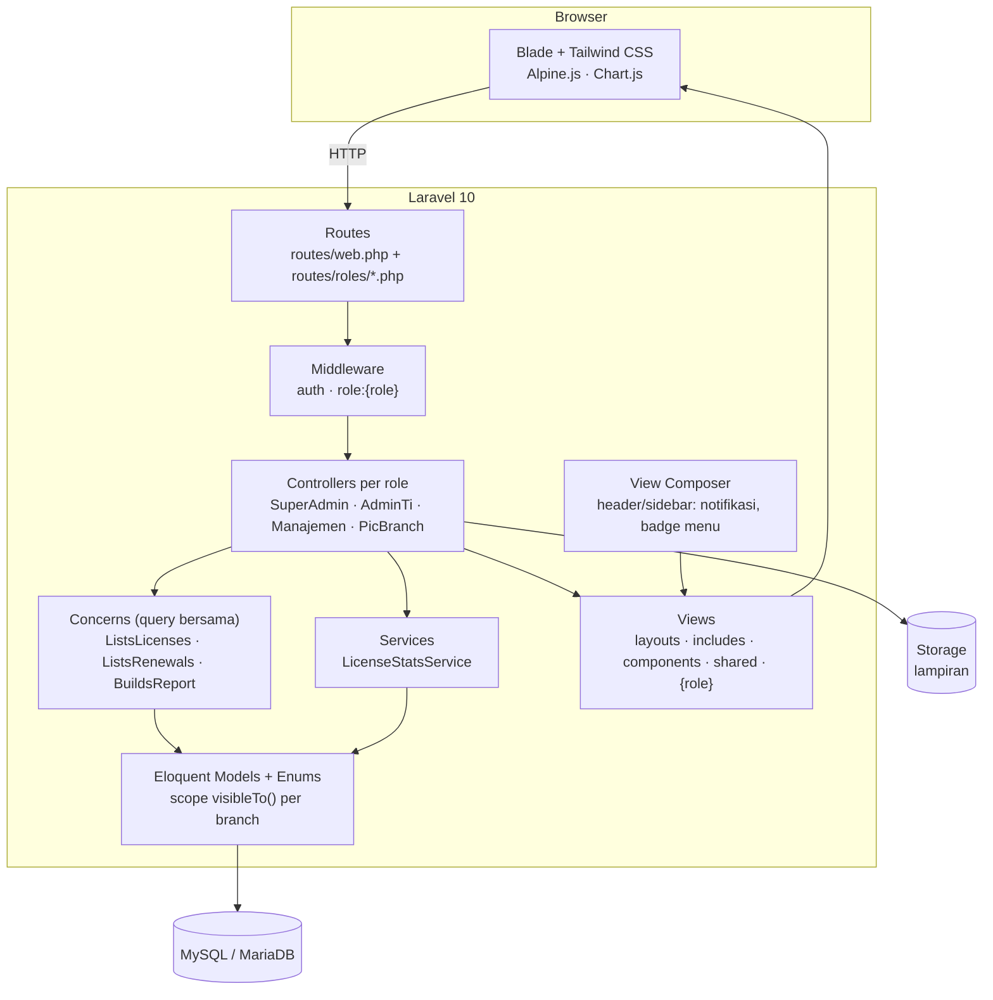
```mermaid
flowchart TB
    subgraph Browser
        UI["Blade + Tailwind CSS<br/>Alpine.js · Chart.js"]
    end

    subgraph Laravel["Laravel 10"]
        R["Routes<br/>routes/web.php + routes/roles/*.php"]
        MW["Middleware<br/>auth · role:{role}"]
        C["Controllers per role<br/>SuperAdmin · AdminTi · Manajemen · PicBranch"]
        CC["Concerns (query bersama)<br/>ListsLicenses · ListsRenewals · BuildsReport"]
        SV["Services<br/>LicenseStatsService"]
        M["Eloquent Models + Enums<br/>scope visibleTo() per branch"]
        V["Views<br/>layouts · includes · components · shared · {role}"]
        VC["View Composer<br/>header/sidebar: notifikasi, badge menu"]
    end

    DB[("MySQL / MariaDB")]
    FS[("Storage<br/>lampiran")]

    UI -->|HTTP| R --> MW --> C
    C --> CC --> M
    C --> SV --> M
    M --> DB
    C --> FS
    C --> V --> UI
    VC --> V
```

**Prinsip desain**

- **Satu folder per role** — route (`routes/roles/{role}.php`), controller (`Controllers/{Role}`), view (`views/{role}`), menu (`includes/menus/{role}`).
- **Controller tipis** — query yang dipakai lintas role ada di trait `Controllers/Concerns`, angka dashboard/laporan di `LicenseStatsService`.
- **Keamanan data per branch** — scope `visibleTo($user)` di model + `authorizeBranch()` di controller untuk halaman detail.
- **Enum sebagai sumber kebenaran** status & tipe (`label()`, `badge()`), kolom database tetap string.
- **Layout modular** — `includes/` (head, header, sidebar, footer, flash, pagination) dan Blade components (`x-badge`, `x-modal`, `x-stat-card`, `x-period-bar`, `x-form.*`, …).

---

## 🗄️ Struktur Database

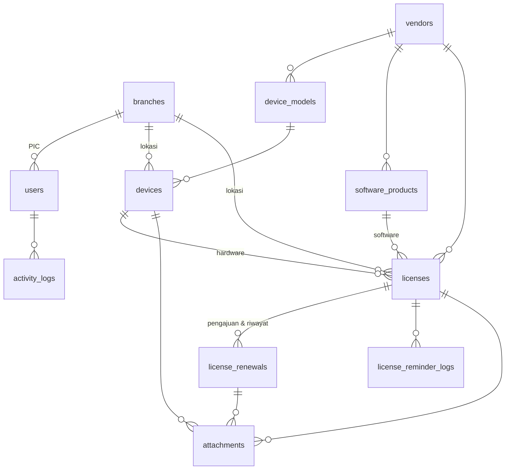
```mermaid
erDiagram
    branches ||--o{ users : "PIC"
    branches ||--o{ devices : lokasi
    branches ||--o{ licenses : lokasi
    vendors ||--o{ device_models : ""
    vendors ||--o{ software_products : ""
    vendors ||--o{ licenses : ""
    device_models ||--o{ devices : ""
    devices ||--o{ licenses : "hardware"
    software_products ||--o{ licenses : "software"
    licenses ||--o{ license_renewals : "pengajuan & riwayat"
    licenses ||--o{ license_reminder_logs : ""
    licenses ||--o{ attachments : ""
    license_renewals ||--o{ attachments : ""
    devices ||--o{ attachments : ""
    users ||--o{ activity_logs : ""
```

| Tabel | Isi |
|---|---|
| `branches` | Lokasi (Kantor Pusat / Branch / Terminal) |
| `users` | Akun, `role`, `branch_id` |
| `vendors` | Palo Alto Networks, Sangfor, HPE Aruba, Microsoft, … |
| `device_models` | PA-440, PA-3410, IAG 50/51/52, HPE 5710/5520, … |
| `devices` | Unit fisik — serial number unik, hostname, IP, status |
| `software_products` | Produk software (mis. Microsoft Office) |
| `licenses` | Lisensi berjalan — tipe, paket, `key_format` + key terenkripsi, seat, periode, biaya, PO |
| `license_renewals` | Pengajuan + riwayat perpanjangan (snapshot periode lama → baru) |
| `attachments` | Lampiran polimorfik (sertifikat, foto key, PO, invoice, BAST, …) |
| `license_reminder_logs` | Reminder yang sudah terkirim (anti dobel) |
| `activity_logs` | Audit trail |
| `settings` | Ambang status & hari reminder |
| `notifications` | Notifikasi in-app |

**Data awal** — migration `2026_11_23_000012_import_data_referensi_excel` mengisi pengaturan, 25 lokasi, vendor, model perangkat, dan **55 perangkat + lisensi** (Palo Alto 25, Sangfor 21, HPE Aruba 9, beserta 7 riwayat perpanjangan Aruba) dari data Excel inventaris. Data yang tidak ada di sumber (license key, start date Sangfor) dibiarkan kosong — tidak dikarang.

Dokumen desain lengkap: [`docs/DESAIN-ROLE-DAN-DATABASE.md`](docs/DESAIN-ROLE-DAN-DATABASE.md).

---

## 📁 Struktur Folder

```
app/
├── Enums/                      UserRole, ExpiryStatus, LicenseType, LicenseKeyFormat, RenewalStatus, …
├── Http/
│   ├── Controllers/
│   │   ├── Auth/               Login
│   │   ├── Concerns/           Query bersama lintas role
│   │   ├── SuperAdmin/         User, Branch, Vendor, DeviceModel, SoftwareProduct, Setting, ActivityLog
│   │   ├── AdminTi/            Dashboard, Device, License, Renewal, Report, ActivityLog
│   │   ├── Manajemen/          Dashboard, Approval, License, Report, ActivityLog
│   │   └── PicBranch/          Dashboard, License, Device, Renewal
│   ├── Middleware/             EnsureUserHasRole (alias "role")
│   └── Requests/
├── Models/                     + Concerns/ScopedByBranch
├── Services/                   LicenseStatsService
├── Support/helpers.php         tgl(), rupiah(), sisa_hari(), role_route(), per_page()
└── View/Composers/             LayoutComposer
database/
├── migrations/                 skema + import data Excel
└── seeders/                    akun demo
resources/
├── css/app.css                 komponen Tailwind (card, btn, form, table, badge)
├── js/app.js                   Alpine store tema + komponen chart
└── views/
    ├── layouts/                app, auth
    ├── includes/               head, header, sidebar, footer, scripts, flash, pagination, menus/
    ├── components/             x-icon, x-badge, x-modal, x-stat-card, x-period-bar, x-form.*, …
    ├── shared/                 partial lintas role (licenses, renewals, devices, dashboard, …)
    ├── super-admin/  admin-ti/  manajemen/  pic-branch/
    └── auth/  profile/  notifications/  errors/
routes/
├── web.php
└── roles/                      super-admin.php, admin-ti.php, manajemen.php, pic-branch.php
docs/                           desain role & database, screenshots
tests/Feature/                  akses halaman per role, format license key
```

---

## 🚀 Instalasi & Menjalankan

### Prasyarat

- PHP **8.1+** (disarankan 8.2) dengan ekstensi `pdo_mysql`, `mbstring`, `openssl`, `fileinfo`
- Composer 2
- Node.js 18+ & npm
- MySQL 5.7+ / MariaDB 10.4+ (mis. dari XAMPP)

### Langkah

```bash
# 1. Clone
git clone https://github.com/ahsanul22/simlis-pelindo.git
cd simlis-pelindo

# 2. Dependency
composer install
npm install

# 3. Environment
cp .env.example .env        # Windows (cmd): copy .env.example .env
php artisan key:generate
```

Buat database kosong (mis. lewat phpMyAdmin) lalu sesuaikan `.env`:

```env
DB_CONNECTION=mysql
DB_HOST=127.0.0.1
DB_PORT=3306
DB_DATABASE=sistem-monitoring-lisensi
DB_USERNAME=root
DB_PASSWORD=
```

```bash
# 4. Skema + data inventaris dari Excel
php artisan migrate

# 5. (Opsional, development) akun demo per role
php artisan db:seed

# 6. Build aset frontend
npm run build               # atau `npm run dev` saat development (hot reload)

# 7. Jalankan
php artisan serve
```

Buka **http://127.0.0.1:8000**.

> 🔁 Reset total database saat development: `php artisan migrate:fresh --seed`
> ⚠️ Perintah ini menghapus semua tabel — jangan dijalankan di server yang sudah berisi data asli.

---

## 🔑 Akun Demo

Tersedia setelah `php artisan db:seed`. Password semua akun: **`password`** — wajib diganti di production.

| Username | Role | Branch |
|---|---|---|
| `superadmin` | Super Admin | Kantor Pusat |
| `admin.ti` | Admin TI | Kantor Pusat |
| `manajemen` | Manajemen | Kantor Pusat |
| `pic.bima` | PIC Branch | Bima |
| `pic.makassar` | PIC Branch | Makassar |

Di mode `APP_ENV=local`, halaman login menampilkan tombol pintas untuk akun-akun di atas.

---

## 🧪 Testing

```bash
php artisan test
```

Test memakai **SQLite in-memory** (lihat `phpunit.xml`) sehingga tidak menyentuh database MySQL. Cakupan saat ini:

- Setiap halaman per role dapat dibuka, role lain mendapat **403**.
- PIC Branch tidak dapat membuka data branch lain.
- Format license key (tanpa key / teks / foto) dan pembatasan visibilitas foto key.
- Seluruh data Excel tampil di daftar.

---

## 🗺️ Status Pengembangan

| Tahap | Status |
|---|---|
| 1. Desain role & database, migration, model, import data Excel | ✅ Selesai |
| 2. Frontend — layout, semua halaman per role dengan data asli | ✅ Selesai |
| 3. Backend — aksi simpan, alur perpanjangan, upload, notifikasi, reminder terjadwal, export | 🚧 Dalam pengerjaan |

Rencana tahap 3:

- [ ] CRUD master data, user, perangkat, lisensi (FormRequest + audit log)
- [ ] Alur perpanjangan: ajukan, batal, setujui/tolak, selesaikan
- [ ] Upload lampiran & foto license key (disk private, unduh dengan cek izin)
- [ ] Notifikasi in-app & email
- [ ] Command reminder harian (`schedule:run`) dengan `license_reminder_logs`
- [ ] Export laporan Excel / PDF
- [ ] Update profil & password, pengaturan
- [ ] Pembuatan akun PIC massal untuk seluruh branch

---

<div align="center">
<sub>Dibuat untuk kebutuhan monitoring lisensi TI multi-lokasi · Laravel · Tailwind CSS · Alpine.js</sub>
</div>
